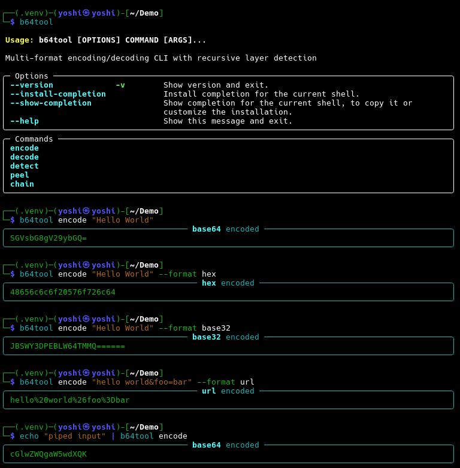

# b64tool Demo

This page shows what the tool looks like when you run it. Install with `uv tool install b64tool` or follow the setup steps in [README.md](README.md).

## Encoding

Base64, Hex, Base32, and URL encoding with piped input support.

## Decoding, detection, and layer peeling

File encoding, multi-format decoding, auto-detection with confidence scoring, recursive layer stripping, and multi-step encoding chains.

