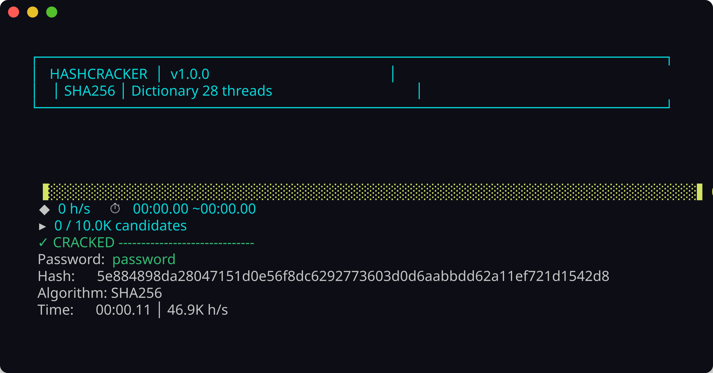
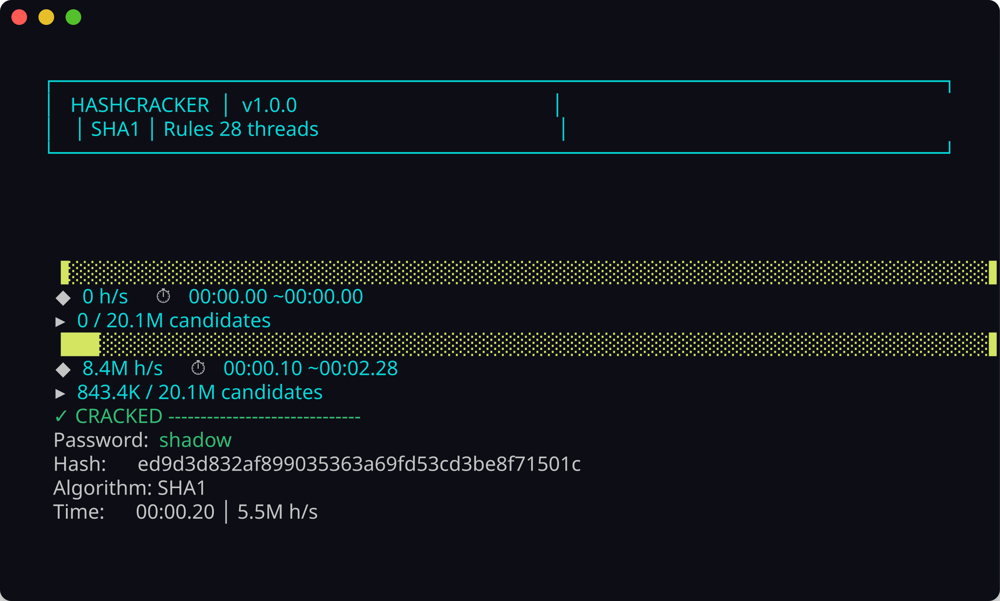

# Hash Cracker — Demo

This page shows what the tool looks like when you actually run it. I tested everything on Linux with the included wordlists. If you want to reproduce these runs yourself, install the tool with `./install.sh` first (see README.md).

## Dictionary attack

A memory-mapped wordlist scan with auto-detected hash type. Work is partitioned across all CPU cores and you get a live progress bar with hashes-per-second throughput.

```bash
hashcracker --hash 5e884898da28047151d0e56f8dc6292773603d0d6aabbdd62a11ef721d1542d8 \
  --wordlist wordlists/10k-most-common.txt
```



The SHA256 hash above is for the word `password`. It finds it almost immediately because `password` is near the top of the 10K most common passwords list.

## Rule-based mutations

When you add `--rules`, the tool applies mutation transforms to every word in the dictionary — capitalize, leet speak, digit append, reverse, toggle case. A 10K wordlist expands into about 20.1 million candidates.

```bash
hashcracker --hash ed9d3d832af899035363a69fd53cd3be8f71501c \
  --wordlist wordlists/10k-most-common.txt --rules
```



This takes longer than a plain dictionary scan because of the expanded candidate space, but it catches passwords like `Shadow1` or `dRAGON` that would never appear verbatim in a wordlist.

## Brute-force (bonus)

If you want to see the brute-force mode in action on a short password:

```bash
hashcracker --hash 5e884898da28047151d0e56f8dc6292773603d0d6aabbdd62a11ef721d1542d8 \
  --bruteforce --charset lower --max-length 8
```

This tries every lowercase combination up to 8 characters. It works for `password` but gets slow fast as you increase `--max-length` or add more character sets.
