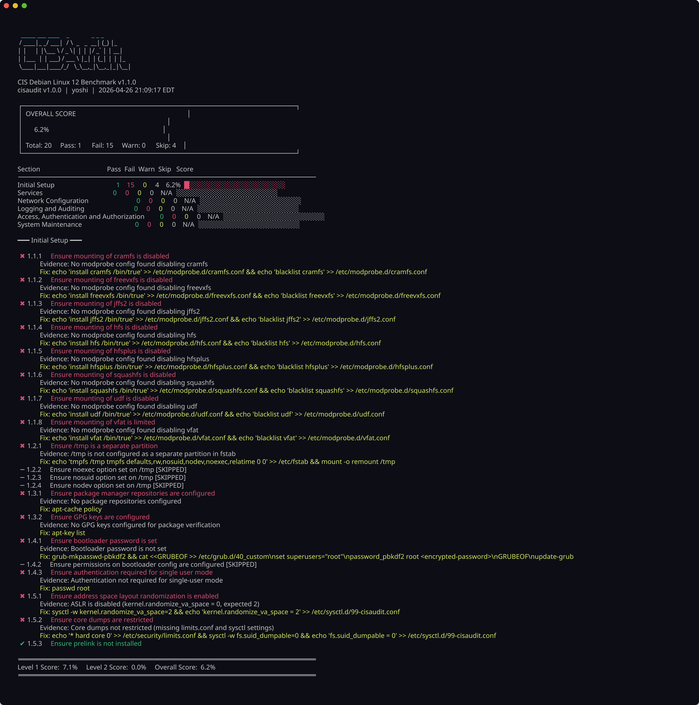
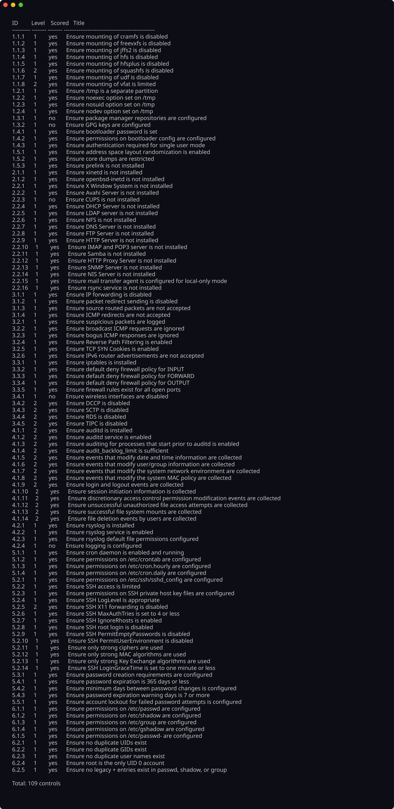

# CIS Hardening Auditor — Demo

A walkthrough of what the tool looks like in practice. Screenshots are in the `assets/` folder.

## Getting started

```bash
./install.sh
sudo cisaudit
```

## Audit report

The audit report shows section-level scores with per-control evidence, severity, and remediation commands. The screenshot below was taken against a fixture root, so it runs without elevated privileges.



## Control catalog

The control catalog lists all registered controls across six CIS categories. Each entry shows its section, benchmark level, and whether it is scored or informational.


