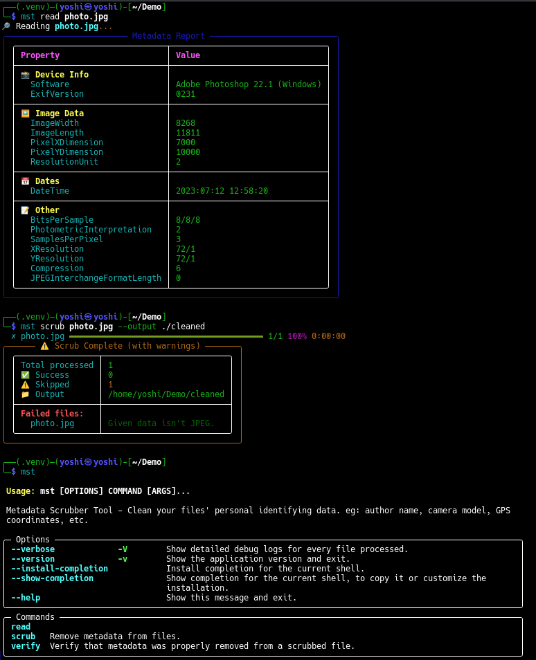

# Metadata Scrubber — Demo

A walkthrough of the read, scrub, and verify workflow. Screenshots are in the `assets/` folder.

## Install

```bash
uv tool install metadata-scrubber
```

## Read, scrub, and verify

The demo shows three steps:

1. **Read** — inspect metadata and get a categorized report (device info, image data, GPS, timestamps)
2. **Scrub** — batch-remove metadata with a progress bar
3. **Verify** — confirm metadata was removed after scrubbing


