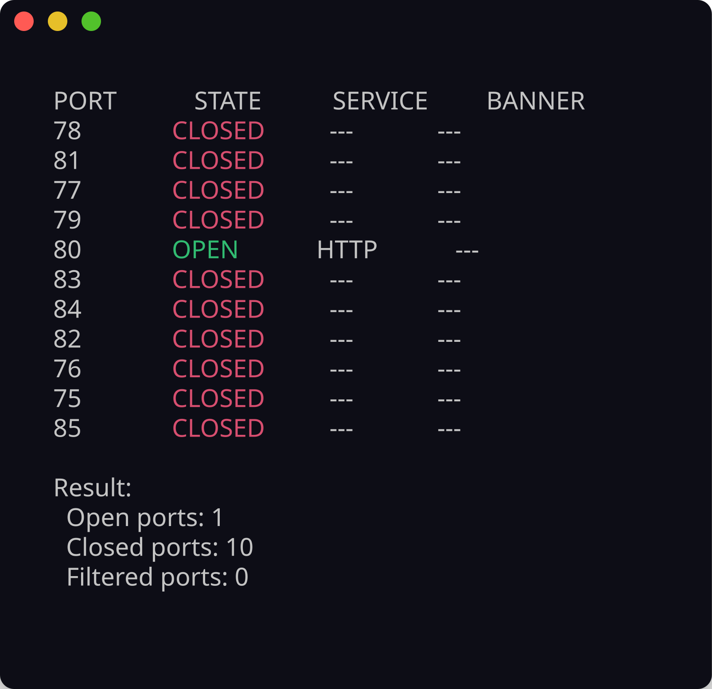

# Simple Port Scanner — Demo

Example runs and screenshots for the port scanner.

## Build first

```bash
mkdir build && cd build
cmake ..
cmake --build .
```

## SSH discovery

Scan a target on common SSH ports with verbose output. The scanner reports OPEN, CLOSED, or FILTERED for each port and shows service names plus banners when available.

```bash
./simplePortScanner -i scanme.nmap.org -p 20-25 -v
```


## HTTP discovery

Scan a range of HTTP-related ports with high concurrency. Results include per-port state, service identification, and a summary count at the end.

```bash
./simplePortScanner -i scanme.nmap.org -p 80-90 -t 200 -v
```



## Notes

- `scanme.nmap.org` is a public test host maintained by the Nmap project. It is a reasonable target for learning scans.
- Full range scans (`1-65535`) take longer. Increase `-t` for speed, but be polite on networks you do not control.
- Filtered ports usually mean a firewall dropped the connection attempt without a clear rejection.
