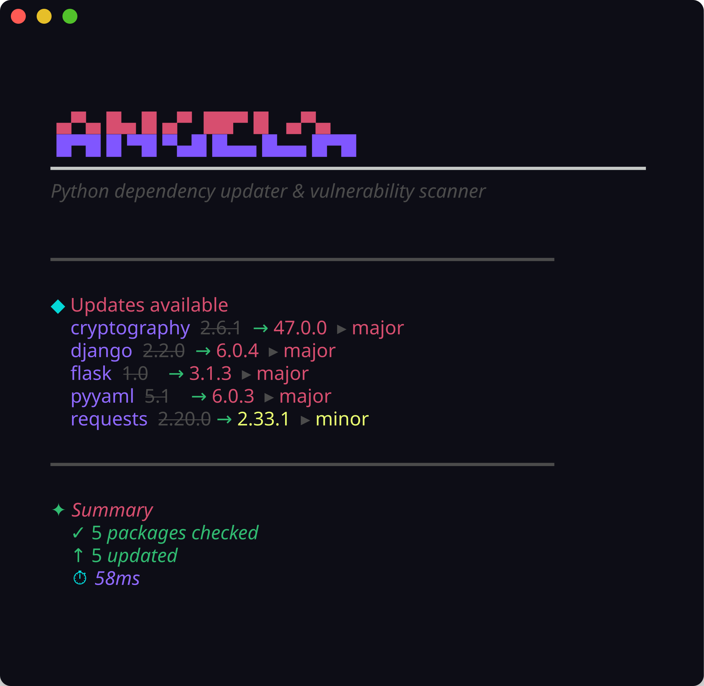
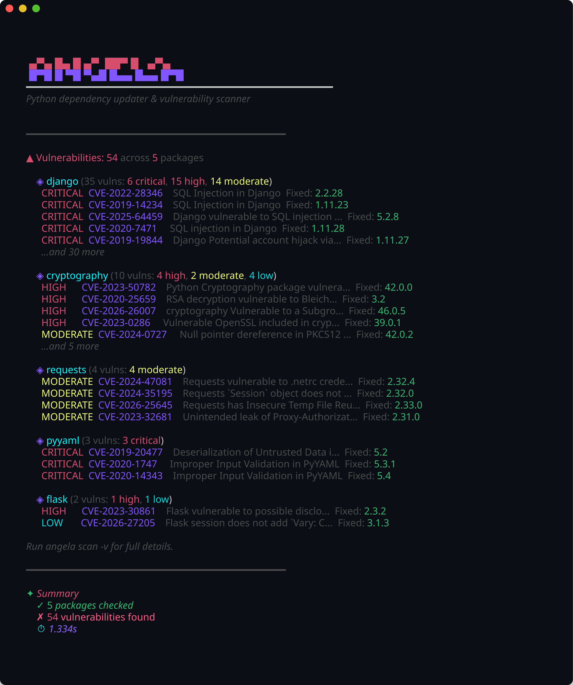

# Simple Vulnerability Scanner — Demo

Example runs and screenshots for the dependency scanner (angela / svscan).

## Build first

```powershell
go build -o svscan.exe ./cmd/angela
```

Or install from upstream:

```bash
go install angela/cmd/angela@latest
```

## Update check

Run `check` against a project with outdated dependencies. The tool queries PyPI in parallel, compares versions using PEP 440 rules, and lists major, minor, and patch upgrades without modifying any files.

```bash
angela check ./testdata
```



## Vulnerability scan

Run `scan` to query OSV.dev for advisories matching your pinned versions. Findings are grouped by package and severity, with the first fixed version shown per advisory.

```bash
angela scan ./testdata
```

Add `-v` for full advisory details.



## Notes

- The scanner only reports issues for packages and versions it can parse from your dependency files.
- A clean scan does not guarantee the project is secure — it reflects what OSV.dev knows about declared dependencies.
- Run `angela cache clear` if PyPI or OSV results look stale after a network change.
