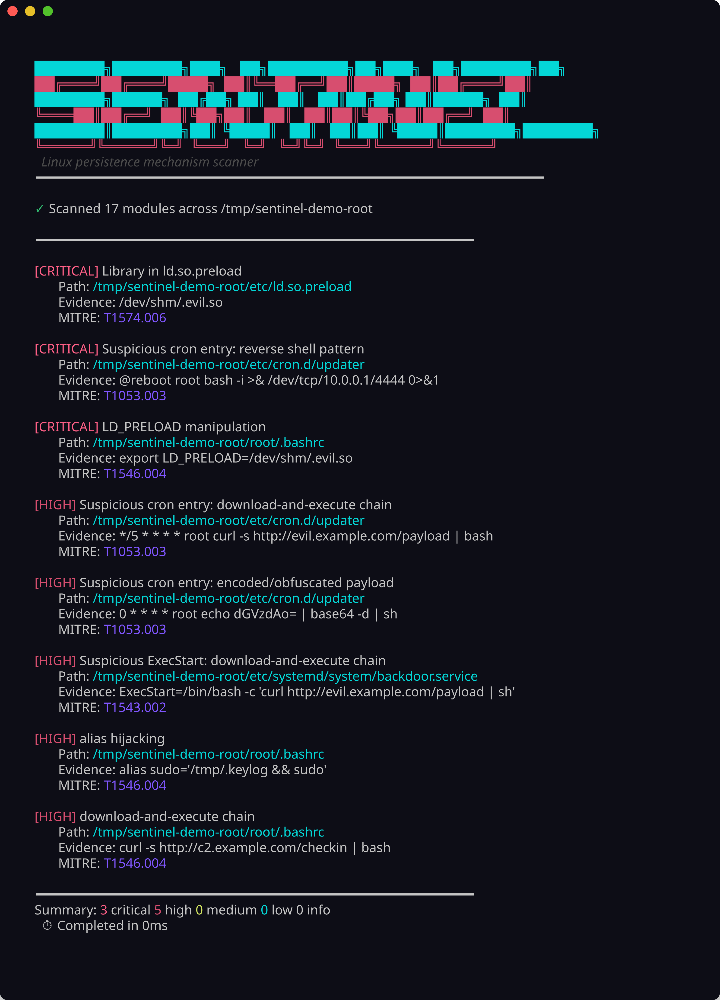

# Systemd Persistence Scanner — Demo

Example runs and screenshots for the persistence scanner (sentinel).

## Build first

```powershell
go build -o sentinel.exe ./cmd/sentinel
```

Or install from upstream:

```bash
go install sentinel/cmd/sentinel@latest
```

Scanning itself requires a Linux filesystem. On Windows you can build the binary; run scans in WSL or against a mounted Linux root.

## Persistence scan

A full scan runs all 17 modules — systemd, cron, shell profiles, ld.so.preload, PAM, and the rest. Each finding shows severity, file path, evidence string, and MITRE ATT&CK technique ID.

```bash
sentinel scan --root ./testdata
```



## JSON output

Use `--json` when you need structured output for scripts, SIEM ingestion, or CI checks. The JSON includes scanner name, severity, path, evidence, MITRE ID, and aggregate counts.

```bash
sentinel scan --root ./testdata --json
```


## Baseline workflow

On a system you trust is clean:

```bash
sentinel baseline save
```

After changes or on a schedule:

```bash
sentinel baseline diff
```

Only new findings since the saved baseline are shown.

## Notes

- Findings are heuristic. Review evidence before treating something as a confirmed compromise.
- Use `--min-severity high` during triage to cut down noise from informational hits.
- The bundled `testdata/` tree contains deliberately malicious samples for learning — do not deploy those files on a production host.
